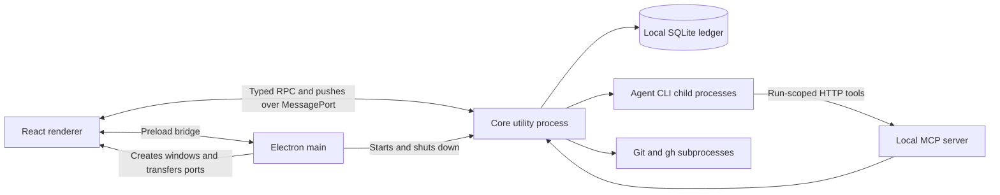
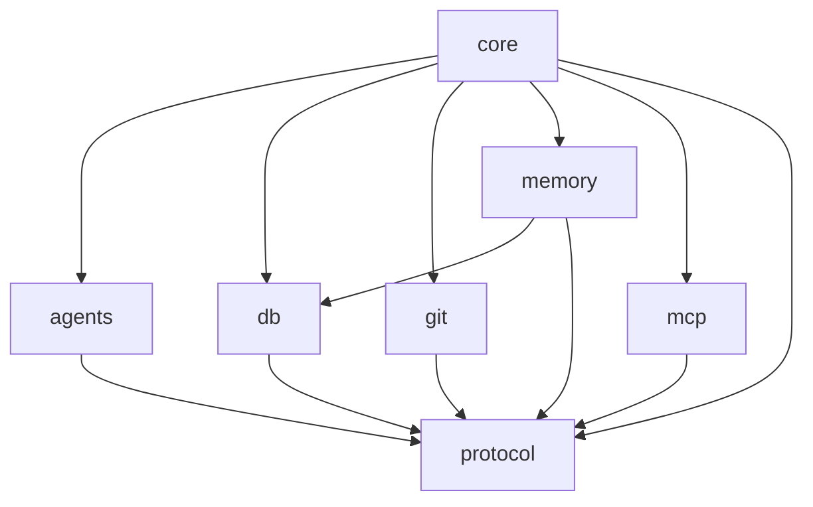

# Architecture

OpenOrc is a TypeScript workspace with an Electron desktop shell. The application core runs in a utility process, separate from window management and rendering. Domain workflows use shared protocol types and can run in tests without launching Electron.

This guide describes the current structure. [PRODUCT.md](PRODUCT.md) describes intended behavior; [ROADMAP.md](ROADMAP.md) records current priorities. The roadmap also lists the next module and platform improvements.

## Process model

- **Main** owns windows, OS integration, terminal and browser panes, and protected Slack and memory-extraction credential storage. It starts the utility process and hands MessagePorts to renderers.
- **Preload** exposes desktop capabilities to the sandboxed, context-isolated renderer.
- **Renderer** presents application state, sends RPC requests, and consumes frames and invalidations. TanStack Query holds requested data; streaming state is maintained separately for live transcripts.
- **Core utility process** hosts application workflows, persistence, provider processes, and the MCP server. The Electron entry point supplies transport and protected-storage adapters to `OpenOrc.create`.

Entry points: [`main/index.ts`](apps/desktop/src/main/index.ts), [`preload/index.ts`](apps/desktop/src/preload/index.ts), [`core/index.ts`](apps/desktop/src/core/index.ts), and [`renderer/src/main.tsx`](apps/desktop/src/renderer/src/main.tsx).

## Module responsibilities and seams

| Module     | Interface and hidden implementation                                                                                                                                                   |
| ---------- | ------------------------------------------------------------------------------------------------------------------------------------------------------------------------------------- |
| `protocol` | Shared schemas for domain records, RPC, and agent events, plus the harness catalog and team state transition rules. This is the common vocabulary; it does not own runtime workflows. |
| `core`     | `OpenOrc.create`, request handling, push transport, and shutdown compose application behavior. Workflow modules own runs, tasks, threads, teams, workspaces, and integrations.        |
| `agents`   | Provider adapters normalize vendor protocols into `AgentEvent` and expose live controls through `RunHandle`. Provider-specific process and stream details stay here.                  |
| `db`       | `Db`, repositories, transactions, migrations, and ledger writing hide SQLite access. Vector retrieval is optional and degrades to full-text search when the extension is unavailable. |
| `git`      | Git operations hide subprocess execution, worktree operations, snapshots, and change integration. GitHub PR creation delegates to the user's `gh`.                                    |
| `memory`   | Extraction, local embeddings, retrieval, and briefs use the persisted project history.                                                                                                |
| `mcp`      | `startMcpServer` accepts a `McpHost` adapter. The server owns HTTP/tool transport; the host owns application behavior and authorization.                                              |

The declared package dependency direction is:

Low-level packages stay independent of the desktop and core workflows. The diagram shows the dependencies each package declares; no automated rule checks imports against it.

## A turn through the system

1. The renderer sends an RPC request with a shared method and parameter shape. The utility-process entry validates the envelope, and the core validates and dispatches the method.
2. The owning workflow resolves the thread or task, execution mode, workspace, and permissions before admitting work.
3. The run module captures the launch environment and starts the selected provider adapter. The run receives a scoped URL for local MCP tools.
4. The adapter normalizes provider activity into events. The core persists events and coalesces renderer frames; application changes also invalidate query data.
5. On completion or interruption, the owning workflow settles run and task state, workspace checkpoints, and any queued work. Persisted history supports reopening and transcript replay.

Execution location, authorization, and turn state are application invariants. Keep them in the core rather than reproducing decisions in renderer code or provider adapters.

## Persistence and lifetime

SQLite uses the built-in `node:sqlite` driver. The desktop core owns its connection. Repository transactions use savepoints so nested operations compose. Migrations advance `PRAGMA user_version`; each migration is transactional and checks foreign keys. Existing migration history must remain compatible with persisted ledgers.

The app's profile also contains attachments and managed workspaces. A database backup alone does not include those files. Use a disposable profile for QA through `pnpm qa:onboarding`.

Shutdown ordering is explicit in `OpenOrc.close`: integration and workflow shutdown precede provider cleanup, then ledger flushing, MCP closure, and database closure. Modules that acquire processes, ports, timers, or subscriptions should expose a clear lifetime and release them on failure as well as normal completion.

## Team execution

`TeamCoordinator` is the only writer of team journals and the one API callers use. It owns admission, run authority, turn launch and settlement, stop and recovery. Four parts share its services through `TeamCore`: `TeamDelivery` (mailbox and live steering), `TeamChat` (room chat, ambient reads, file claims, warm member sessions and shared-workspace capture), `TeamAssignments` (delegation down the hierarchy, wait and completion) and `TeamScheduler` (wake-ups, capacity, deadlines and failure containment). `TeamTurns` holds what the process has in flight. Actors, turns and executions change state only along the transition tables in `@openorc/protocol`.

A journal is stored as rows (`team_actors`, `team_attempts`, `team_messages`, `team_claims`); each turn's prompt is kept apart in `team_attempt_prompts`. Reading checks structure only and is cached per connection. A write validates the whole journal in memory, checks the database only for the entries it adds or changes, and rewrites only those rows. A restart fences every previous run and holds only turns whose provider had started for inspection; queued and waiting work continues, and restarts never count against retries. An execution that cannot be read or advanced is reported and skipped; it never stops startup or other teams.

`TeamConversationService` builds the conversation view from one journal read and the execution's room events. The view carries what the renderer needs to place each item: the manager turn that dispatched each assignment (`dispatchedBy`), when each turn ended, and which chat entry is the opening message. The renderer's `teamFeed` only sorts and groups; it reads no transcripts and makes no timing guesses. Journals recorded before `dispatchedBy` existed fall back to the manager's latest earlier turn.

## Changing the architecture

Depth means that callers get substantial behavior through a small interface. A useful extraction moves invariants and failure handling together; moving a switch into another file without hiding complexity does not improve depth.

- Keep composition in `OpenOrc`, but move domain policy into its owning workflow when it can be exercised through a smaller interface.
- Treat provider model discovery and revision-aware caching as a coherent candidate module, separate from live-run ownership.
- Keep transport adapters thin; domain tests should exercise the same interface used by callers with a fake transport or provider.
- Test database upgrades using historical fixtures and the real current open/migration path.
- Preserve replay behavior when changing streaming events or transcript projection.

Refactor one seam at a time with existing behavior checks. `pnpm check:size` limits file and function size; see [code quality checks](docs/code-quality.md).
