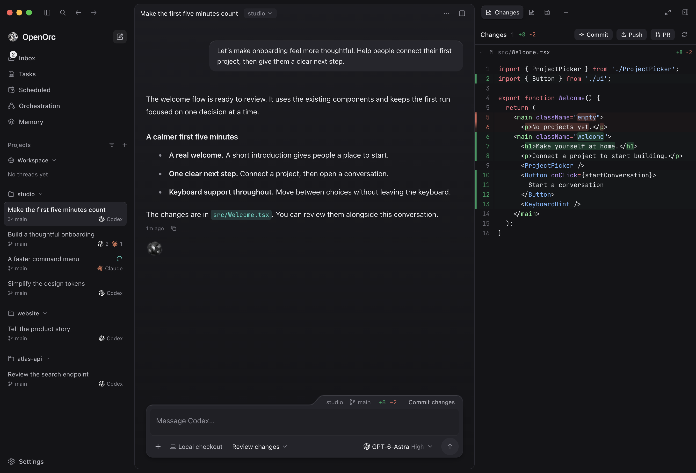
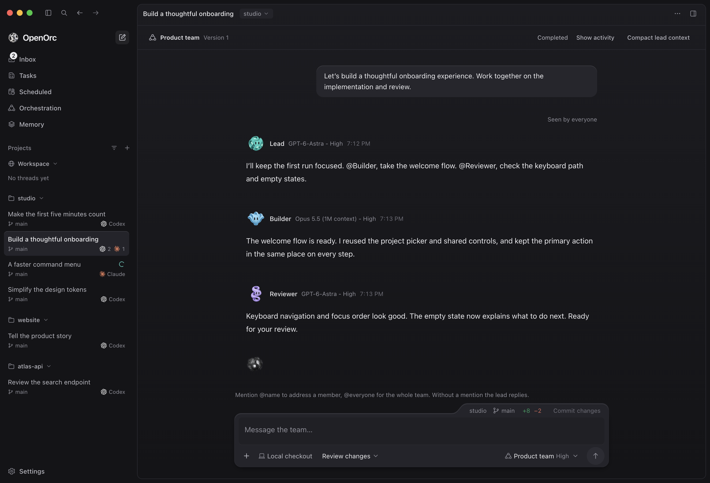
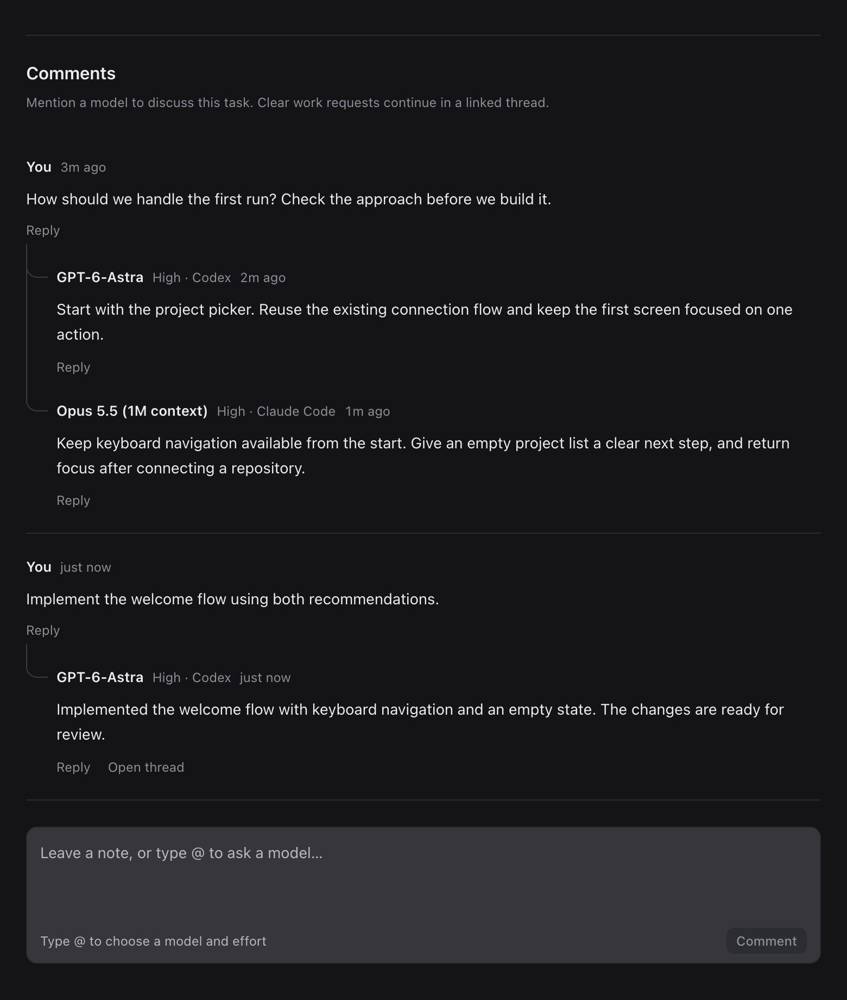

<p align="center">
  
</p>

<h1 align="center">OpenOrc</h1>

<p align="center"><strong>Your coding agents, working together.</strong></p>

<p align="center">
  <a href="#why-openorc">Why OpenOrc</a> ·
  <a href="#run-from-source">Get started</a> ·
  <a href="docs/README.md">Documentation</a> ·
  <a href="CONTRIBUTING.md">Contribute</a>
</p>

OpenOrc is a **desktop workspace for Codex, Claude Code, and OpenCode**. Bring your existing agents and accounts to plan work, build features, and review changes in one place.

Work with a single agent or assemble a team across providers. Agents can share context between threads and carry project decisions into the next task, so you spend less time repeating yourself.

## Why OpenOrc

Choose an agent for each job while keeping the work connected through shared conversations, tasks, and project memory.

### Share context across threads and providers

Let a Claude Code thread building your interface ask a Codex thread about an API decision. Agents can find, read, and message other OpenOrc threads in the same project, saving you from copying context between conversations.

An idle thread starts a new turn to read a message; a busy thread receives it during its current turn. Agents can send up to 4 messages in a row across threads. After that, a person has to write before they can send more.

### Give each agent a role

Have Codex coordinate, Claude Code build, and another agent review. Save the team with a role, provider, and model for each member. Follow their contributions in one conversation and address a member directly when you need their input.

Team execution is in Beta and enabled for new profiles. Manage **Team execution (Beta)** in **Settings → General → Orchestration**; saved on/off choices are preserved. See [team recovery and limitations](https://openorc.app/docs/teams/#recovery).

### Keep what your project learns

Save decisions, lessons, and useful commands as project memory. An agent can retrieve that knowledge in a later task, even if it uses a different provider.

Memory is optional. Turn it off or configure automatic extraction in Settings.

### Turn ideas into reviewed changes

Capture an idea as a task, ask multiple models for input, then start implementation when you're ready. Work in your local checkout or an isolated worktree, and review changes beside the conversation.





_Screenshots use sample projects and conversations._

<details>
<summary>See a task discussion with Codex and Claude Code</summary>

Get a second perspective before you build. Request implementation when you're ready, then follow the work in a linked thread.



</details>

## Project status

OpenOrc was initially built in private and is now open source. It is in active beta development.

| Platform             | Status                                                                                                                                                                                |
| -------------------- | ------------------------------------------------------------------------------------------------------------------------------------------------------------------------------------- |
| macOS, Apple Silicon | Supported. CI runs the full test suite here.                                                                                                                                          |
| macOS, Intel         | Released, but not fully validated. Release builds pass the packaged startup and update checks; the test suite runs only on Apple Silicon.                                             |
| Windows x64          | Released, but not fully validated. Release builds are installed and smoke-tested; the test suite does not run on Windows. A beta installer can be unsigned; its release notes say so. |
| Linux                | Not a release target.                                                                                                                                                                 |

See the [release guide](docs/desktop-updates.md) and [roadmap](ROADMAP.md).

## Run from source

You'll need **Node.js 24**, **pnpm 11.21.0**, and Git on your shell's PATH. These Node and pnpm versions are recorded in `.node-version` and `package.json`. Install and sign in to at least one supported agent CLI. The GitHub CLI (`gh`) is optional and enables pull request workflows.

| Agent       | Setup                                                                                      |
| ----------- | ------------------------------------------------------------------------------------------ |
| Codex       | [Install Codex CLI](https://developers.openai.com/codex/cli), then run `codex login`       |
| Claude Code | [Install Claude Code](https://code.claude.com/docs/en/setup), then run `claude auth login` |
| OpenCode    | [Install OpenCode](https://opencode.ai/docs/), then run `opencode auth login`              |

Use your existing provider accounts. No separate OpenOrc account is required.

From a clone of this repository:

```sh
pnpm install --frozen-lockfile
pnpm dev
```

Import a project with the plus button next to Projects, then start a thread with **⌘N**.

Tasks save to the backlog until you start them. Choose a local checkout or isolated worktree in the task's **Execution settings**. New tasks default to **Settings → General → Workspace**; tasks created from a conversation use that thread's location. Changing the location after work starts moves the task's conversation.

A task's changes appear in its conversation's **Changes** panel, where you can comment on lines, commit, push, or open a pull request. See [task behavior](docs/task-editor.md) and the [product model](PRODUCT.md).

For a disposable development profile that does not use your regular OpenOrc data:

```sh
pnpm qa:onboarding --dev
```

See [CONTRIBUTING.md](CONTRIBUTING.md) for native dependency troubleshooting, verification, and focused development commands.

## Data and credentials

Conversations, task records, and project memory are stored on your machine. Each agent's requests go to its own provider, and a small model from the conversation's own agent names the conversation. Memory is off until you turn it on. While it is on, the agent that ran each finished run summarizes it, unless you choose one provider for every run, and the first search by meaning downloads an 83 MB embedding model from Google Cloud Storage, checked against a pinned SHA-256. Installed releases check GitHub Releases for new stable versions, without an installation identifier; Settings → General turns automatic checks off. Betas are published as prereleases, which the updater never offers, so install betas manually. [Network connections](https://openorc.app/docs/network/) lists every connection the app makes.

The desktop stores its SQLite ledger, attachments, images tools return, and managed workspaces in the application data directory: `~/Library/Application Support/OpenOrc` on macOS and `%APPDATA%\OpenOrc` on Windows. `OPENORC_USER_DATA` selects a different profile. Treat this directory as private: it can contain prompts, source snippets, terminal output, and project history. Native provider output goes to a debug log in `logs/provider` there, kept for 14 days or 512 MB; deleting a thread does not remove its lines from that log before they expire. Redaction of the ledger, its search index, run results, memories, and logs is a best-effort filter, not a guarantee that all sensitive content is removed. Plans, task comments, and team messages are stored as written because agents receive them later.

Agent execution uses the installed CLIs and their existing login flows. The Claude usage display asks the installed Claude Code CLI for its plan usage; OpenOrc never reads the credential Claude Code stores. Direct Slack credentials and the optional memory-extraction API key use Electron's OS-backed protected storage. See [credential storage](docs/credential-storage.md) for recovery and backup considerations.

## Develop and verify

```sh
pnpm typecheck
pnpm lint
pnpm format:check
pnpm check:size
pnpm test
pnpm build
```

CI runs these checks. [Code quality checks](docs/code-quality.md) explains the lint, formatting, and size rules, and [CONTRIBUTING.md](CONTRIBUTING.md#verification) lists the additional script tests. Live-provider smoke tests are separate and can execute agent work using your account; see [CONTRIBUTING.md](CONTRIBUTING.md) before running them.

## Repository guide

| Location            | Responsibility                                                        |
| ------------------- | --------------------------------------------------------------------- |
| `apps/desktop`      | Electron shell, core utility-process entry point, and React interface |
| `apps/website`      | Astro website, docs, and HTML/CSS product demos                       |
| `packages/core`     | Application workflows and validated RPC handling                      |
| `packages/protocol` | Shared domain records, events, harness catalog, and RPC schemas       |
| `packages/agents`   | Vendor CLI adapters and normalized agent events                       |
| `packages/db`       | SQLite migrations, repositories, ledger, and retrieval storage        |
| `packages/git`      | Git commands, worktrees, snapshots, and change integration            |
| `packages/memory`   | Embeddings, extraction, retrieval, and project briefs                 |
| `packages/mcp`      | Run-scoped local MCP server and host interface                        |
| `scripts`           | Reproducible QA fixtures and smoke checks                             |

Read the [architecture guide](ARCHITECTURE.md) for the process model and module seams, [interface conventions](docs/design-system.md) for visual conventions, and [the documentation index](docs/README.md) for feature references. The [roadmap](ROADMAP.md) records current priorities.

Generated previews and test screenshots belong in ignored `output/` or temporary directories. Curated README images are tracked with their [capture record](docs/images/readme/README.md). Keep runtime artwork tracked, along with any editable source it has. The Rive mascot is included only as its runtime file; see the [mascot record](assets/mascot/README.md).

## Inspirations

OpenOrc takes inspiration from the [Codex desktop app](https://developers.openai.com/codex/app/), [Claude Desktop](https://code.claude.com/docs/en/desktop), and [Conductor](https://www.conductor.build/), with a focus on helping agents from different providers work together.

## License

OpenOrc's original code and documentation are licensed under the [Apache License, Version 2.0](LICENSE). See [NOTICE](NOTICE) for project attribution. Third-party dependencies and separately licensed assets retain their respective licenses and notices.

The conversation indicator uses the original Apache-2.0 Hollow shader with a separately licensed MIT runtime. Provider marks retain separate rights. See [third-party notices](THIRD_PARTY_NOTICES.md) and [artwork provenance](docs/artwork-provenance.md) for attribution, asset sources, and permission limits.

The license does not grant trademark rights to the OpenOrc name or branding, except for the descriptive uses permitted by the license.
